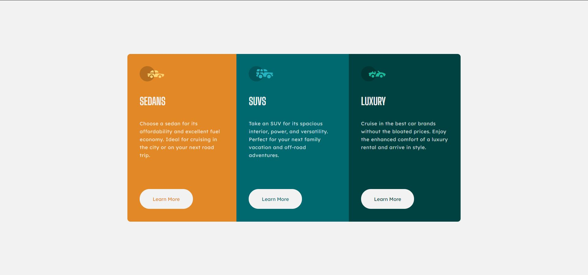

# Frontend Mentor - 3-column preview card component solution

This is a solution to the [3-column preview card component challenge on Frontend Mentor](https://www.frontendmentor.io/challenges/3column-preview-card-component-pH92eAR2-). Frontend Mentor challenges help you improve your coding skills by building realistic projects.

## Table of contents

- [Overview](#overview)
  - [The challenge](#the-challenge)
  - [Screenshot](#screenshot)
  - [Links](#links)
- [My process](#my-process)
  - [Built with](#built-with)
  - [What I learned](#what-i-learned)
  - [Continued development](#continued-development)
  - [Useful resources](#useful-resources)
- [Author](#author)
- [Acknowledgments](#acknowledgments)

**Note: Delete this note and update the table of contents based on what sections you keep.**

## Overview

### The challenge

Users should be able to:

- View the optimal layout depending on their device's screen size
- See hover states for interactive elements

### Screenshot

### Links

- Solution URL: [https://www.frontendmentor.io/solutions/responsive-design-using-html-css-9Pm9O4SrJ](https://www.frontendmentor.io/solutions/responsive-design-using-html-css-9Pm9O4SrJ)
- Live Site URL: [https://3-column-preview-card-component-main-woad.vercel.app/](https://3-column-preview-card-component-main-woad.vercel.app/)

## My process

### Built with

- Semantic HTML5 markup
- CSS custom properties
- Flexbox

### What I learned

The major learnings in this project are layouting the content, flexbox and responsive web design.

### Useful resources

- [Flexbox](https://developer.mozilla.org/en-US/docs/Learn/CSS/CSS_layout/Flexbox) - This helped me in learning flexbox. I really liked this pattern and will use it going forward.

## My links

- Frontend Mentor - [@SaiChandra2896](https://www.frontendmentor.io/profile/SaiChandra2896)
- Twitter - [@yourusername](https://twitter.com/saichan58535512)
- LinkedIn - [@Sai Chandra](https://www.linkedin.com/in/sai-chandra-065101152/)
